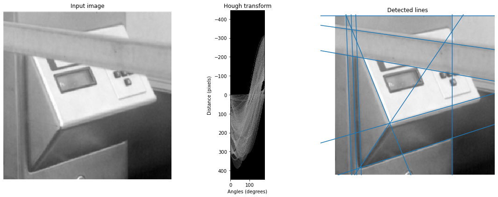

# Computer Vision And Pattern Recognition Projects

This repo contains some Computer Vision and Pattern Recognition mini projects using Python, Jupyter Notebook, Numpy, OpenCV and some other libraries.
These projects are done in order to understand concepts of Computer Vision better and also show its actual usage in many daily cases.

## Mini Project 1: Template Matching
  * Learn about basic image pre-processing steps and template matching.
  * Explore template matching usage for translation symmetry detection.

## Mini Project 2: Canny Edge Detector and Hough Transform
  * Learn about edge detection using Canny edge detector
  * Explore line and circle detection from these edges using Hough Transform.

## Mini Project 3: Feature Matching and Applications
  * Learn about key point detection using Harris Corner Detector (simplified version of SIFT descriptor)
  * Explore 2 applications of keypoint matching: image stitching and symmetry detection.

## Mini Project 4: Translation Symmetry Detection
  * Learn about keypoint detection, clustering, image transformation and RANSAC.
  * Explore their usage to propose lattices of translation symmetric structures.

